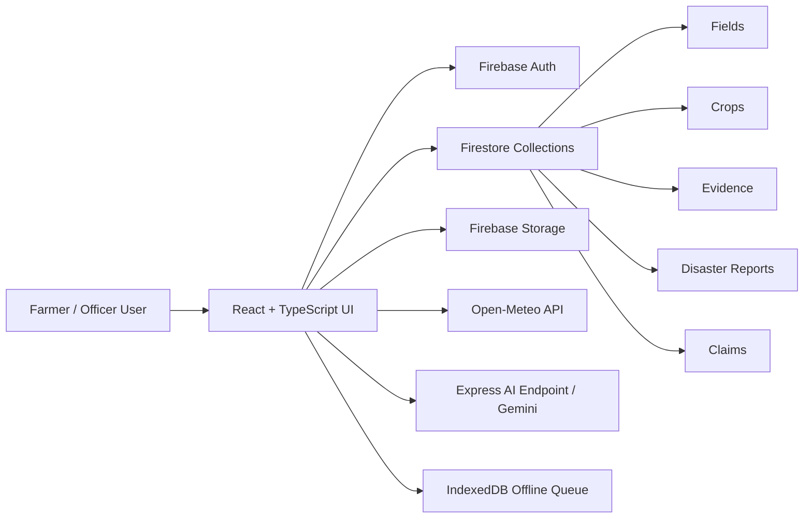

# AgriShield

AgriShield is a smart crop insurance evidence platform that helps farmers record field and crop data, capture geo-tagged proof of crop condition, report disasters, and support insurance claim review with weather and AI-assisted assessment workflows.

---

## 1. Problem Statement

India’s crop insurance processes often depend on fragmented farmer records, delayed field verification, and inconsistent evidence submission. In practice, settlement decisions can be delayed because field-level information, crop condition records, disaster reports, and weather data are not integrated into a single workflow.

AgriShield addresses this by creating a prototype system that connects:

- farmer field and crop registration
- geo-tagged evidence capture
- disaster reporting
- weather correlation for the registered field
- claim progression from evidence collection to officer review

This is designed as a working prototype for SIH-style evaluation and demonstration, not as a production-grade insurance platform.

---

## 2. Solution Overview

AgriShield is a React + TypeScript web application with Firebase-based authentication and Firestore persistence. It supports two user roles:

- Farmer portal for registration, field management, crop tracking, evidence capture, and disaster reporting
- Insurance Officer portal for claim review and decision-making

The app combines:

- Firebase Authentication for user identity and role resolution
- Firestore for structured data persistence
- Firebase Storage for uploaded crop evidence images
- Express server endpoints for AI image assessment using Gemini
- Open-Meteo weather API retrieval for the selected field area
- A local offline queue for evidence when connectivity is unavailable

---

## 3. Current Implementation Status

### Implemented

- Farmer login and registration via Firebase Email/Password authentication
- Officer login workflow with role-based routing
- Firestore-backed farmer and officer profile loading
- Field registration with polygon / coordinate boundary support
- Crop registration under each field
- Geo-tagged evidence collection workflow with image upload and metadata persistence
- Disaster report entry linked to a field/crop and claim creation
- Weather correlation for active field locations using Open-Meteo data
- Claim lifecycle creation and status updates from evidence collection to review
- Officer dashboard for reviewing claims and making decisions
- Localized language selector using a shared app-level translation dictionary
- Offline queue handling for evidence sync when connectivity is lost
- AI crop-damage assessment endpoint with fallback behavior when Gemini is unavailable

### In Progress

- Production-grade claim rules and adjudication logic
- Broader end-to-end data validation across all flows
- Hardening of the prototype for deployment beyond a local or demo environment
- Full multilingual coverage across every screen and state label
- Stronger operational analytics and audit history for claims

### Planned

- Full production security and RBAC review
- Comprehensive audit logs and immutable documentation trails
- Advanced fraud detection and anomaly checks
- Multi-tenant or district-level scaling
- Full mobile-first workflow optimization and field usability improvements
- Deployment automation and CI/CD pipeline

---

## 4. Key Features Currently Implemented

### Farmer Portal

The farmer portal includes:

- login or registration flow
- farmer profile creation and local persistence
- field registration including survey number, area, soil type, and map-based boundary coordinates
- crop registration under each field
- evidence timeline and evidence completeness tracking
- disaster reporting tied to a field and crop
- summary of claims and claim status
- access to localized UI and status indicators

### Insurance Officer Portal

The officer portal includes:

- officer login and role-aware routing
- claim queue review
- scoring and evidence review context
- officer decision updates for approved, rejected, or more-evidence-required outcomes
- claim metadata and damage summary review
- field and farmer context retrieval associated with each relevant claim

### Firebase Authentication and Role-Based Access

The application initializes Firebase and uses Email/Password authentication via Firebase Auth.

Implemented behavior in the current codebase:

- `src/lib/firebase.ts` initializes Firebase app, Firestore, Storage, and auth objects
- `src/context/AuthContext.tsx` handles:
  - `login()` for farmers
  - `register()` for new farmer accounts
  - `loginAsOfficer()` for an officer account
  - `logout()`
  - role detection via Firestore user data and a profile lookup
- role-based UI gating is used to switch between farmer and officer screens
- the app checks for an officer profile vs farmer profile and renders the matching portal

### Firestore Data Handling

Firestore is used for persistent app data across the user journey. The current codebase reads and writes records for:

- farmers
- farmer-specific fields
- field-specific crops
- crop evidence
- disaster reports
- claims
- officer decision updates

Core service logic is defined in `src/lib/firestoreService.ts` and includes:

- farmer profile fetch/update
- field and crop CRUD logic
- evidence persistence and retrieval
- disaster and claim storage
- real-time claim subscription logic
- Firestore batch writes for field + crop registration

### Field and Crop Registration

The app supports:

- registration of a field with name, survey number, soil type, and coordinates
- storage of field metadata and boundary points
- registration of crop records for each field with type, variety, sowing date, expected harvest date, crop stage, and season
- immediate UI updates after successful save

### Geo-Tagged Evidence Workflow

The evidence workflow in the current app includes:

- field and crop context for evidence capture
- image upload (to Firebase Storage where available)
- evidence metadata such as type, GPS coordinates, timestamp, crop stage, notes, and verification state
- rule-based verification evaluation
- AI-assisted crop damage assessment through the server endpoint
- evidence completeness tracking for fields and claims

### Disaster Reporting

Farmers can submit disaster reports for an impacted field, including:

- disaster type
- date/time
- description
- associated field/crop selection
- linked claim creation for review processing

When a disaster report is submitted, the app creates a claim record and updates the evidence collection workflow.

### Weather Integration

Weather is currently integrated for the selected field via Open-Meteo:

- weather fetch occurs for the relevant field coordinates
- data is filtered around the disaster date when available, otherwise a recent rolling window is used
- rainfall, wind, and temperature metrics are displayed in a weather correlation panel
- event summary and correlation check output are shown in the UI

### Current Claim / Review Workflow

The current claim flow is:

1. Farmer registers a field and crop.
2. Farmer captures post-disaster or field evidence.
3. Disaster is reported and a claim is created.
4. Evidence completeness is computed.
5. AI damage summaries and preliminary loss estimates are generated.
6. Officer reviews the claim and updates decision status.
7. The claim status and officer remarks are persisted back to Firestore.

This is implemented as a working prototype workflow, not a complete claims-production engine.

---

## 5. Technology Stack

| Layer | Technology |
| --- | --- |
| Frontend | React 19, TypeScript, Vite |
| UI Styling | Tailwind CSS |
| Icons | Lucide React |
| Maps / Geospatial | Leaflet |
| Charts | Recharts |
| Backend / API | Express + Node.js |
| Cloud Auth | Firebase Authentication |
| Database | Firestore |
| File Storage | Firebase Storage |
| AI Assessment | Google Gemini via `@google/genai` |
| Weather API | Open-Meteo |
| Offline storage | IndexedDB via custom offline store |
| Environment config | `.env` variables |

### Core dependencies from the current project

```json
{
  "react": "^19.0.1",
  "firebase": "^12.18.0",
  "vite": "^6.2.3",
  "express": "^4.21.2",
  "@google/genai": "^2.4.0",
  "leaflet": "^1.9.4",
  "recharts": "^3.10.1",
  "lucide-react": "^0.546.0",
  "tailwindcss": "^4.1.14",
  "dotenv": "^17.2.3"
}
```

---

## 6. Project Architecture and Data Flow

### High-level architecture



### Data flow

1. A farmer logs in or registers an account.
2. The app resolves the user role from Firestore and sets the appropriate portal.
3. The farmer registers one or more fields and associated crops.
4. The farmer captures evidence images for the field and crop.
5. The evidence includes GPS metadata and AI/verification assessment.
6. A disaster report can be linked to an active field and crop.
7. A claim is created and tracked in Firestore.
8. Weather data for the selected field is fetched and linked to the claim context.
9. An insurance officer reviews the claim and updates its decision.

---

## 7. Project Folder Structure

```text
agrishield/
├── .env.example
├── .env
├── dist/
├── firebase-blueprint.json
├── firestore.rules
├── index.html
├── metadata.json
├── node_modules/
├── package.json
├── package-lock.json
├── server.ts
├── tsconfig.json
├── vercel.json
├── vite.config.ts
├── src/
│   ├── App.tsx
│   ├── index.css
│   ├── main.tsx
│   ├── components/
│   │   ├── auth/
│   │   │   ├── LoginPage.tsx
│   │   │   └── RegisterPage.tsx
│   │   ├── dossier/
│   │   │   └── EvidenceDossier.tsx
│   │   ├── farmer/
│   │   │   ├── BeforeAfterComparison.tsx
│   │   │   ├── CropRegistrationModal.tsx
│   │   │   ├── DisasterReportModal.tsx
│   │   │   ├── EvidenceTimeline.tsx
│   │   │   ├── FarmerDashboard.tsx
│   │   │   ├── FarmerProfileModal.tsx
│   │   │   ├── FieldRegistrationModal.tsx
│   │   │   └── GuidedEvidenceCapture.tsx
│   │   ├── layout/
│   │   │   ├── Header.tsx
│   │   │   └── WalkthroughModal.tsx
│   │   ├── maps/
│   │   │   ├── FieldRegistrationMap.tsx
│   │   │   └── MultiPointDamageMap.tsx
│   │   ├── officer/
│   │   │   └── OfficerDashboard.tsx
│   │   └── weather/
│   │       └── WeatherCorrelationPanel.tsx
│   ├── context/
│   │   ├── AppContext.tsx
│   │   └── AuthContext.tsx
│   ├── lib/
│   │   ├── demoData.ts
│   │   ├── firebase.ts
│   │   ├── firestoreService.ts
│   │   ├── geoUtils.ts
│   │   ├── i18n.ts
│   │   ├── offlineStore.ts
│   │   └── verificationEngine.ts
│   └── types/
│       └── index.ts
└── firebase.json (if present in a Firebase deployment setup)
```

---

## 8. Setup and Environment Variables

Copy `.env.example` to a local `.env` file and populate the required values.

Required Firebase variables:

```env
VITE_FIREBASE_API_KEY=
VITE_FIREBASE_APP_ID=
VITE_FIREBASE_AUTH_DOMAIN=
VITE_FIREBASE_MESSAGING_SENDER_ID=
VITE_FIREBASE_PROJECT_ID=
VITE_FIREBASE_STORAGE_BUCKET=
VITE_OFFICER_EMAIL=
VITE_OFFICER_PASSWORD=
```

The project also uses:

- `GEMINI_API_KEY` in the Express server for the AI crop-damage assessment endpoint

Do not commit real Firebase credentials, API keys, or secrets to the repository.

---

## 9. Local Development Commands

Install dependencies:

```bash
npm install
```

Start the development app:

```bash
npm run dev
```

This uses the Express server entrypoint `server.ts` and runs the Vite app in development mode.

Run a type check:

```bash
npm run lint
```

Build production bundle:

```bash
npm run build
```

Start the built production server:

```bash
npm start
```

---

## 10. Build and Deployment Instructions

### Current build support

The project includes a production build pipeline in `package.json`:

```bash
npm run build
```

This command:

- runs Vite production build
- bundles the Express server with esbuild
- outputs a Node-compatible server bundle in `dist/server.cjs`

### Deployment guidance

The application is currently structured for a Node-based deployment environment, not a fully hardened cloud deployment pipeline.

The project includes a `vercel.json` rewrite stub, but the actual runtime server is an Express/Node app and the build output is generated as a Node bundle. It is best suited to a Node-compatible host, container runtime, or a static + server deployment workflow that supports both Vite build assets and the Express server.

This repository is not yet a production deployment package and should be treated as a prototype and staging-level application.

---

## 11. Current Limitations / Work in Progress

This project is a working SIH prototype and still has the following limitations:

- it is not a production-grade insurance platform
- authentication and Firestore access are not yet hardened for large-scale multi-tenant deployment
- Firestore rules are currently permissive for prototype use and should be tightened before production
- claim logic is operational but still prototype-driven rather than fully regulated insurance adjudication logic
- weather and AI assessment are integrated but remain dependent on environment configuration and external APIs
- the app still contains some prototype UI elements and demo-friendly defaults in local flows
- feature completeness varies by workflow and should be treated as staged development work

---

## 12. SIH Prototype Scope

This repository is scoped as an SIH prototype focused on demonstrating that an integrated crop-insurance evidence workflow can be built around:

- farmer onboarding
- field and crop registration
- evidence capture and verification
- disaster reporting
- AI-assisted damage assessment
- weather correlation
- officer review and decision support

The goal is to show a practically usable digital workflow for crop insurance verification in a constrained prototype environment.

---

## 13. Security Considerations

The current implementation provides a functional prototype but should be treated carefully before any real-world use:

- keep Firebase secrets in `.env` and never commit them to Git
- validate all API and storage access paths before production rollout
- restrict Firestore access based on role and verified user identity in a real deployment
- avoid storing sensitive personal or KYC information without proper policy and permissions
- use environment-specific credentials for development, staging, and production
- ensure AI API keys and service credentials are not exposed in frontend bundles or source control

The current Firestore rules in the repository are broad and suitable only for prototype-level development:

```firestore
rules_version = '2';
service cloud.firestore {
  match /databases/{database}/documents {
    match /{document=**} {
      allow read, write: if request.auth != null;
    }
  }
}
```

---

## 14. Prototype Disclaimer

AgriShield is a prototype application designed for demonstration, evaluation, and research in an SIH context. It is not a production insurance adjudication system, not a legal/compliance-certified platform, and not intended for direct real-world claim settlement without additional validation, auditing, policy review, and security hardening.

Use this repository for prototype testing, stakeholder demonstration, and technical evaluation only.

---

## 15. License

This project is licensed under the MIT License. See the [LICENSE](LICENSE) file for the full text.

## 16. Summary

AgriShield currently implements a usable farmer and officer workflow for smart crop insurance evidence collection and review. It integrates Firebase, Firestore, image storage, disaster reporting, weather data, AI-assisted damage assessment, and claim lifecycle tracking in a single prototype platform designed for SIH evaluation and further engineering.
